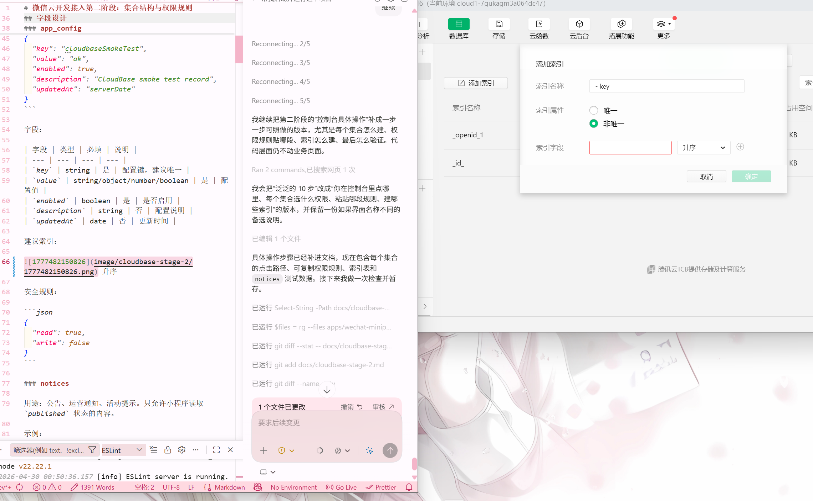
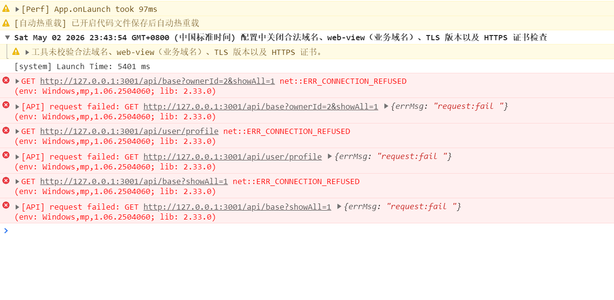
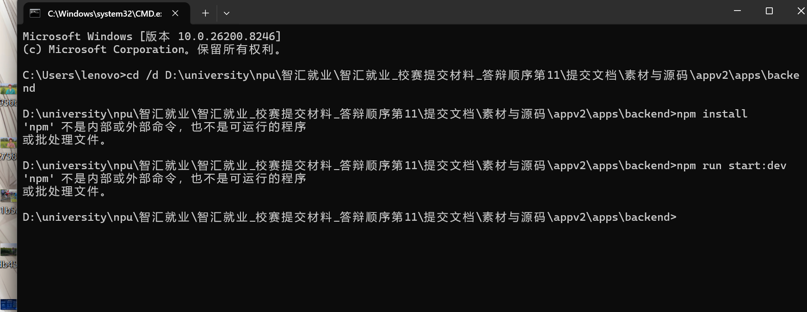
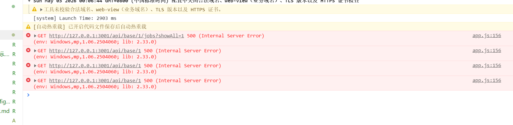
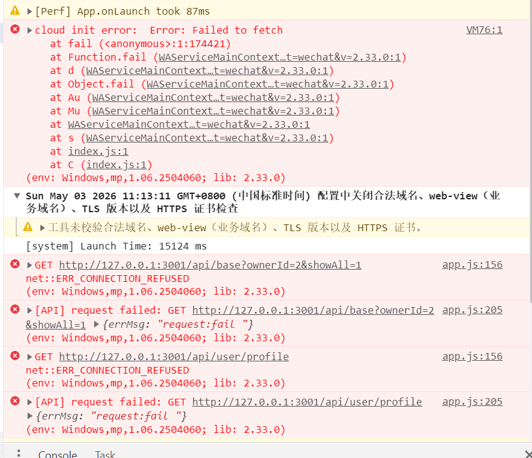

# 微信云开发接入第二阶段：集合结构与权限规则

第二阶段目标：在不迁移核心业务的前提下，先把低风险云数据库集合、权限规则、索引和验证方式设计清楚，后续再逐个模块接入。

## 边界

继续保留在 MySQL 和后端 API：

- 登录认证
- 用户账号与角色权限
- 身份证、手机号、银行卡等敏感信息
- 考勤主数据
- 工资和支付结算
- 基地、岗位、报名主流程

本阶段只设计这些云数据库集合：

```text
app_config
notices
feedbacks
client_logs
file_assets
```

## 集合总览

| 集合 | 用途 | 小程序端权限 | 写入来源 | 是否影响核心业务 |
| --- | --- | --- | --- | --- |
| `app_config` | 小程序配置、开关、提示文案 | 可读，不可写 | 控制台或后端服务 | 否 |
| `notices` | 公告、通知、运营提示 | 只读已发布内容 | 控制台或后端服务 | 否 |
| `feedbacks` | 用户反馈、问题上报 | 用户创建并读取自己的反馈 | 小程序端 | 否 |
| `client_logs` | 小程序端非敏感日志 | 用户只写，不读 | 小程序端 | 否 |
| `file_assets` | 云存储文件元数据 | 用户只读写自己的文件元数据 | 小程序端或后端服务 | 否 |

## 字段设计

### app_config

用途：存放小程序低风险配置，不存放密钥、密码、后端地址白名单之外的敏感信息。

示例：

```json
{
  "key": "cloudbaseSmokeTest",
  "value": "ok",
  "enabled": true,
  "description": "CloudBase smoke test record",
  "updatedAt": "serverDate"
}
```

字段：

| 字段 | 类型 | 必填 | 说明 |
| --- | --- | --- | --- |
| `key` | string | 是 | 配置键，建议唯一 |
| `value` | string/object/number/boolean | 是 | 配置值 |
| `enabled` | boolean | 是 | 是否启用 |
| `description` | string | 否 | 配置说明 |
| `updatedAt` | date | 否 | 更新时间 |

建议索引：

 升序

安全规则：

```json
{
  "read": true,
  "write": false
}
```

### notices

用途：公告、运营通知、活动提示。只允许小程序读取 `published` 状态的内容。

示例：

```json
{
  "title": "系统公告",
  "content": "欢迎使用智汇就业小程序。",
  "status": "published",
  "scope": "all",
  "priority": 10,
  "publishAt": "serverDate",
  "expireAt": null,
  "createdAt": "serverDate",
  "updatedAt": "serverDate"
}
```

字段：

| 字段 | 类型 | 必填 | 说明 |
| --- | --- | --- | --- |
| `title` | string | 是 | 公告标题 |
| `content` | string | 是 | 公告正文 |
| `status` | string | 是 | `draft` / `published` / `archived` |
| `scope` | string | 是 | `all` / `worker` / `boss` / `admin` |
| `priority` | number | 否 | 排序权重 |
| `publishAt` | date | 否 | 发布时间 |
| `expireAt` | date/null | 否 | 过期时间 |
| `createdAt` | date | 否 | 创建时间 |
| `updatedAt` | date | 否 | 更新时间 |

建议索引：

- `status` 升序
- `scope` 升序，`status` 升序
- `status` 升序，`publishAt` 降序

安全规则：

```json
{
  "read": "doc.status == 'published'",
  "write": false
}
```

查询约束：小程序查询时必须带上 `status: 'published'`，否则可能被规则拒绝。

### feedbacks

用途：用户反馈、问题上报、建议收集。不存放身份证、银行卡、完整手机号等敏感信息。

示例：

```json
{
  "userId": 3,
  "userRole": "worker",
  "category": "bug",
  "content": "页面加载异常",
  "contact": "",
  "status": "open",
  "createdAt": "serverDate",
  "updatedAt": "serverDate"
}
```

字段：

| 字段 | 类型 | 必填 | 说明 |
| --- | --- | --- | --- |
| `userId` | number/string | 否 | 后端用户 ID，用于排查；不要作为唯一权限依据 |
| `userRole` | string | 否 | 当前角色快照 |
| `category` | string | 是 | `bug` / `suggestion` / `service` / `other` |
| `content` | string | 是 | 反馈内容 |
| `contact` | string | 否 | 可选联系方式，建议脱敏 |
| `status` | string | 是 | `open` / `processing` / `closed` |
| `createdAt` | date | 否 | 创建时间 |
| `updatedAt` | date | 否 | 更新时间 |

建议索引：

- `_openid` 升序，`createdAt` 降序
- `status` 升序，`createdAt` 降序

安全规则：

```json
{
  "read": "doc._openid == auth.openid",
  "create": "auth.openid != null || auth.uid != null",
  "update": "doc._openid == auth.openid || doc._openid == auth.uid",
  "delete": false
}
```

风险控制：

- 用户只能读写自己创建的反馈。
- 管理端处理反馈时，不建议小程序端直接提权；后续应由后端服务或云函数处理。
- 用户端不允许删除反馈，避免反馈记录被随意清理。
- 查询用户自己的反馈时，查询条件必须包含 `_openid: '{openid}'`。

### client_logs

用途：记录小程序端非敏感错误、兼容性问题、云数据库读写失败等。不得记录 token、身份证、银行卡、完整手机号、密码、后端响应敏感内容。

示例：

```json
{
  "level": "warn",
  "event": "cloudbase_query_failed",
  "message": "Query failed",
  "page": "pages/index/index",
  "platform": "devtools",
  "createdAt": "serverDate"
}
```

字段：

| 字段 | 类型 | 必填 | 说明 |
| --- | --- | --- | --- |
| `level` | string | 是 | `info` / `warn` / `error` |
| `event` | string | 是 | 事件名 |
| `message` | string | 否 | 简短信息 |
| `page` | string | 否 | 页面路径 |
| `platform` | string | 否 | 运行平台 |
| `createdAt` | date | 否 | 创建时间 |

建议索引：

- `_openid` 升序，`createdAt` 降序
- `level` 升序，`createdAt` 降序

安全规则：

```json
{
  "read": false,
  "create": "auth.openid != null || auth.uid != null",
  "update": false,
  "delete": false
}
```

风险控制：

- 只允许写入，不允许小程序端读取日志。
- 只允许创建，不允许小程序端更新或删除日志。
- 上线前必须对日志字段做脱敏。
- 后续如需后台查询，应通过后端服务或控制台查询。

### file_assets

用途：记录云存储文件的低风险元数据，例如反馈附件、公告图片等。文件实际内容仍在云存储。

示例：

```json
{
  "fileId": "cloud://cloud1-7gukagm3a064dc47.xxx/example.png",
  "ownerUserId": 3,
  "businessType": "feedback",
  "businessId": "feedback-doc-id",
  "fileName": "example.png",
  "mimeType": "image/png",
  "size": 1024,
  "createdAt": "serverDate"
}
```

字段：

| 字段 | 类型 | 必填 | 说明 |
| --- | --- | --- | --- |
| `fileId` | string | 是 | 云存储 fileID |
| `ownerUserId` | number/string | 否 | 后端用户 ID 快照 |
| `businessType` | string | 是 | `feedback` / `notice` / `other` |
| `businessId` | string | 否 | 关联文档 ID |
| `fileName` | string | 否 | 文件名 |
| `mimeType` | string | 否 | 文件类型 |
| `size` | number | 否 | 文件大小 |
| `createdAt` | date | 否 | 创建时间 |

建议索引：

- `_openid` 升序，`` 降序
- `businessType` 升序，`businessId` 升序

安全规则：

```json
{
  "read": "doc._openid == auth.openid || doc._openid == auth.uid",
  "create": "auth.openid != null || auth.uid != null",
  "update": "doc._openid == auth.openid || doc._openid == auth.uid",
  "delete": "doc._openid == auth.openid || doc._openid == auth.uid"
}
```

风险控制：

- 小程序端只能操作自己的文件元数据。
- 公告类公共图片不建议由小程序端直接写入，应通过控制台、后端服务或云函数维护。
- 查询自己的文件元数据时，查询条件必须包含 `_openid: '{openid}'`。

## 控制台配置步骤

### 进入数据库控制台

1. 打开微信开发者工具。
2. 打开 `apps/wechat-miniprogram` 项目。
3. 点击顶部“云开发”。
4. 确认顶部当前环境是 `cloud1-7gukagm3a064dc47`。
5. 点击顶部“数据库”。

### 创建缺失集合

`app_config` 已经创建；继续创建下面 4 个集合：

```text
notices
feedbacks
client_logs
file_assets
```

每个集合都按下面步骤创建：

1. 在数据库左侧集合列表区域点击“+”或“创建集合”。
2. 集合名称填写对应名称，例如 `notices`。
3. 如果弹出“权限类型”，优先选择“自定义安全规则”。
4. 如果创建时不能直接选择自定义规则，先选择“所有用户不可读写”，创建成功后再进入权限设置修改。
5. 点击“确定”或“创建”。

### 配置 app_config 权限

如果 `app_config` 当前已经是“所有用户可读”，可以保持不变。为了和项目文档一致，也可以改成自定义安全规则。

操作：

1. 点击左侧集合 `app_config`。
2. 找到“权限设置”“权限管理”或“安全规则”。
3. 选择“自定义安全规则”或“切换到安全规则”。
4. 清空原内容，粘贴：

```json
{
  "read": true,
  "write": false
}
```

5. 点击“保存”。

### 配置 notices 权限

操作：

1. 点击左侧集合 `notices`。
2. 进入“权限设置”“权限管理”或“安全规则”。
3. 选择“自定义安全规则”。
4. 粘贴：

```json
{
  "read": "doc.status == 'published'",
  "write": false
}
```

5. 点击“保存”。

效果：小程序只能读取 `status` 为 `published` 的公告，不能写公告。

### 配置 feedbacks 权限

操作：

1. 点击左侧集合 `feedbacks`。
2. 进入“权限设置”“权限管理”或“安全规则”。
3. 选择“自定义安全规则”。
4. 粘贴：

```json
{
  "read": "doc._openid == auth.openid",
  "create": "auth.openid != null || auth.uid != null",
  "update": "doc._openid == auth.openid || doc._openid == auth.uid",
  "delete": false
}
```

5. 点击“保存”。

效果：用户可以创建反馈、读取和更新自己的反馈，但不能删除反馈。

### 配置 client_logs 权限

操作：

1. 点击左侧集合 `client_logs`。
2. 进入“权限设置”“权限管理”或“安全规则”。
3. 选择“自定义安全规则”。
4. 粘贴：

```json
{
  "read": false,
  "create": "auth.openid != null || auth.uid != null",
  "update": false,
  "delete": false
}
```

5. 点击“保存”。

效果：小程序端只能写入日志，不能读取、修改或删除日志。

### 配置 file_assets 权限

操作：

1. 点击左侧集合 `file_assets`。
2. 进入“权限设置”“权限管理”或“安全规则”。
3. 选择“自定义安全规则”。
4. 粘贴：

```json
{
  "read": "doc._openid == auth.openid || doc._openid == auth.uid",
  "create": "auth.openid != null || auth.uid != null",
  "update": "doc._openid == auth.openid || doc._openid == auth.uid",
  "delete": "doc._openid == auth.openid || doc._openid == auth.uid"
}
```

5. 点击“保存”。

效果：用户只能读写自己的文件元数据。

### 创建索引

索引用来消除控制台里的黄色“索引建议”，并提升后续查询稳定性。不同版本控制台入口可能叫“索引管理”“高级操作”“创建索引”。

通用步骤：

1. 点击左侧集合名。
2. 找到“索引”或“索引管理”。
3. 点击“创建索引”。
4. 按下面表格添加字段和排序。
5. 点击“确定”或“创建”。
6. 等待索引状态变成“已生效”或“正常”。

需要创建的索引：

| 集合 | 索引字段 |
| --- | --- |
| `app_config` | `key` 升序 |
| `notices` | `status` 升序 |
| `notices` | `scope` 升序，`status` 升序 |
| `notices` | `status` 升序，`publishAt` 降序 |
| `feedbacks` | `_openid` 升序，`createdAt` 降序 |
| `feedbacks` | `status` 升序，`createdAt` 降序 |
| `client_logs` | `_openid` 升序，`createdAt` 降序 |
| `client_logs` | `level` 升序，`createdAt` 降序 |
| `file_assets` | `_openid` 升序，`createdAt` 降序 |
| `file_assets` | `businessType` 升序，`businessId` 升序 |

如果控制台暂时不让创建某个索引，可以先跳过；索引缺失通常不会破坏功能，只会影响性能或出现索引建议。

### 添加 notices 测试数据

为了验证公告权限，在 `notices` 集合手动添加两条记录。

第一条：已发布公告。

```json
{
  "title": "云开发测试公告",
  "content": "这是一条 published 测试公告。",
  "status": "published",
  "scope": "all",
  "priority": 10
}
```

第二条：草稿公告。

```json
{
  "title": "草稿公告",
  "content": "这条 draft 公告不应该被小程序读取。",
  "status": "draft",
  "scope": "all",
  "priority": 1
}
```

验证时应只能读到第一条。

## 验证命令

在微信开发者工具 Console 中执行。

### app_config 读取

```js
const app = getApp()
app.getCloudDb().get('appConfig', {
  where: { key: 'cloudbaseSmokeTest' },
  limit: 1
}).then(res => console.log(res.data)).catch(console.error)
```

预期：返回 `cloudbaseSmokeTest` 记录。

### notices 读取

先在 `notices` 集合创建一条 `published` 测试公告，再执行：

```js
const app = getApp()
app.getCloudDb().get('notices', {
  where: { status: 'published' },
  orderBy: 'publishAt',
  order: 'desc',
  limit: 5
}).then(res => console.log(res.data)).catch(console.error)
```

预期：能读取 `published` 公告；不能读取 `draft` 公告。

### feedbacks 写入和读取

```js
const app = getApp()
app.getCloudDb().add('feedbacks', {
  category: 'suggestion',
  content: 'CloudBase feedback smoke test',
  status: 'open',
  userRole: 'worker'
}).then(res => {
  console.log('created', res)
  return app.getCloudDb().get('feedbacks', {
    where: { _openid: '{openid}' },
    limit: 5
  })
}).then(res => console.log(res.data)).catch(console.error)
```

预期：能创建并读取自己创建的反馈。

### client_logs 写入

```js
const app = getApp()
app.getCloudDb().add('clientLogs', {
  level: 'info',
  event: 'cloudbase_stage_2_smoke_test',
  message: 'client log write test',
  page: 'manual-console'
}).then(console.log).catch(console.error)
```

预期：能写入；普通小程序端不能读取。

## 后续迁移顺序

建议第三阶段从 `notices` 或 `feedbacks` 二选一开始：

1. `notices`：只读迁移，风险最低。
2. `feedbacks`：有写入链路，但不影响核心业务。

不建议第三阶段迁移 `client_logs` 作为主功能，因为它更偏运维能力，不容易展示业务价值。

## 验收标准

- 五个集合都已创建。
- 每个集合都已配置对应安全规则。
- `app_config` 可读。
- `notices` 只能读取 `published`。
- `feedbacks` 只能读取自己创建的数据。
- `client_logs` 可写不可读。
- 原登录、考勤、工资、基地、岗位功能不改动、不受影响。
